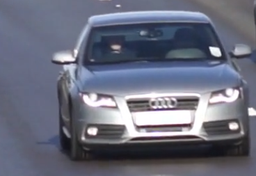
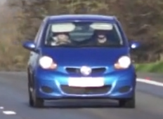

# OpenCV Multi-Car Tracker

This project uses OpenCV to automatically locate and track multiple vehicles in a video. It utilizes **Multi-Scale Template Matching** to find the initial positions of the cars, and then hands over the bounding boxes to the **KCF (Kernelized Correlation Filters)** tracker for real-time tracking performance.

It outputs a video with the drawn bounding boxes and a `.csv` file containing the tracked coordinates of both cars over time.

## Installation

Ensure you have Python installed. You can install the required dependencies using `uv` (recommended) or `pip`:

```bash
uv pip install -r requirements.txt
# OR
pip install -r requirements.txt
```

*(This will install `opencv-contrib-python` which includes the KCF tracker, along with `numpy`)*

## How to Run

Execute the Python script from the terminal:

```bash
python car_tracker.py
```

### Process flow:
1. The script will first scan the video from the beginning without tracking until it finds a reliable match (confidence >= 70%) for the object templates.
2. Once found, it initializes the trackers and displays real-time playback.
3. You can press **`q`** on your keyboard to stop the process prematurely.
4. Finally, it saves the output video to `tracked_output.mp4` and the trajectory data to `tracking_data.csv`.

**Terminal Output Example:**
```text
Scanning video to find initial high-confidence matches...
Match found at Frame 1080!
Displaying real-time tracking... (Press 'q' to stop)
Done! Saved video to tracked_output.mp4 and data to tracking_data.csv
```

## Media Preview

### Templates

Here are the templates used to find the targets:

**Car 1 (Target 1)**  
 

**Car 2 (Target 2)**  


